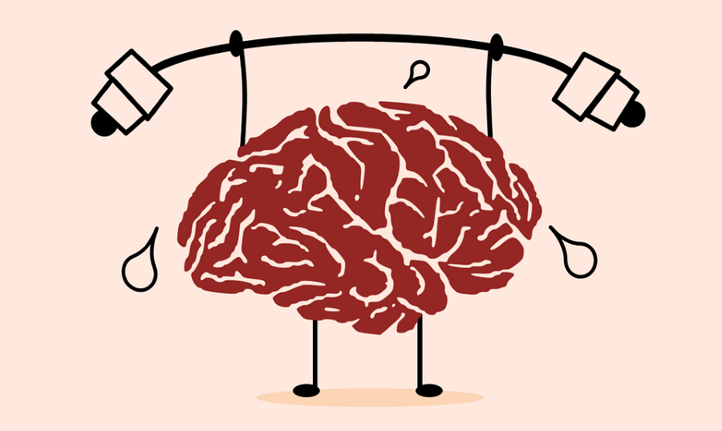

<h1 style="text-align: center;">A Matter of Mind: Pepito’s Cognitive Challenge and Dr. Cajal’s Skepticism</h1>

Please find our Website [here](https://epfl-ada.github.io/ada-2024-project-theadacuates/).


Please find the result notebook [here](results.ipynb).

## Abstract
Recent research suggests that attention spans are decreasing, with cognitive fatigue occurring within minutes of sustained focus [(1)](https://doi.org/10.1111/psyp.12339). Such rapid onset of fatigue is linked to cognitive load theory, which proposes that complex information processing can overwhelm working memory, reducing engagement and performance [(2)](https://pubmed.ncbi.nlm.nih.gov/28237888/). This project investigates **Wikispeedia game** engagement from a **neuroscientific perspective**, focusing on how article complexity, structure, and article network connectivity influence player navigation and performance.
Through this analysis, we aim to develop metrics for assessing **cognitive load and mental fatigue** and to predict path abandonment based on these factors. 
Insights from our study could help us understand human web-browsing behavior and information retrieval in networked data, such as Wikipedia, offering a deeper look into the **cognitive processes involved in these human information-seeking patterns** [(3)](https://dl.acm.org/doi/10.1145/2187836.2187920).

<p align="center">
  
</p>


## Research Questions and Methods

The research question of the project will be introduced through a fictional dialogue between **Pepito**, a struggling player, and his mentor, the renowned **Dr. Santiago Ramón y Cajal**. Pepito, frustrated with his poor performance in the Wikispeedia game, claims that the game’s cognitive complexity causes mental fatigue, affecting his ability to succeed. *“It’s not my fault—it’s the game! It’s intrinsically challenging for the human brain!”* he argues. To support his claim, Pepito sets out to analyze gameplay data, aiming to demonstrate the impact of cognitive load on players’ performance.

Dr. Cajal, however, remains skeptical. He suspects that Pepito’s struggles stem not from the game’s difficulty, but from a lack of basic knowledge. This narrative will present their contrasting views, **exploring whether the game truly imposes significant cognitive strain or if Pepito’s challenges are primarily personal**.

<p align="center">
  
</p>

The main themes presented by Pepito and Dr. Cajal will focus on the following methods:


- **How do simple metrics influence gameplay and mental fatigue in the game?**
    - We hypothesize that simple metrics like *time per path* and *path length* could serve as proxies for mental fatigue. Repeated tasks over extended periods (time) or increasingly complex paths (length) can lead to confusion, which may negatively impact engagement and flow in the game.

- **How does article complexity impact user gameplay, particularly regarding whether the player will abandon or continue toward the target link?**
    - In this case, *Readability metrics*—which assess the ease with which a text can be read and understood by evaluating factors like sentence structure and word difficulty—will be used to measure how well the player comprehends the article. We are specifically looking at the *Flesch-Kincaid Grade Level, Gunning Fog Index, Automated Readability Index, Simple Measure of Gobbledygook,* and *Coleman-Liau Index*. The selected library to calculate the various metrics is [textstat](https://pypi.org/project/textstat/).

- **Can we measure player confusion and indecision during the game and use this measure to predict game abandonment?**
    - We propose that a reasonable measure of confusion and indecision is *Entropy*. We are calculating *Shannon Entropy*, which measures the unpredictability or randomness in user transitions from one article to another. We assume that high entropy can indicate mental fatigue due to unclear path choices. The analysis will be performed first at the individual article level and then averaged across all the articles that constitute one path.
    - Since entropy could be biased by the high number of connections an article may have, and thus not be a good proxy for indecision, we will also examine *graph connectivity*. Along with general connectivity analysis (in-degree, out-degree, closeness, centrality, etc.), we will also study the evolution of path degree as the path progresses, to determine if hub articles play a role in guiding user navigation. The selected library is [networkx](https://pypi.org/project/networkx/).

- **Switching between knowledge categories (e.g., science to arts) requires *cognitive shifting*, which can increase cognitive load. But is the level of shift high enough in the game to make this effect visible?**
    - We will first quantify cognitive shifting with a high-level approximation, i.e., how many times the category of articles switches between consecutive articles in the path.
    - Additionally, we will examine the evolution of *semantic similarity* throughout the paths, which we consider a more explanatory index. We will investigate whether players tend to take larger semantic similarity gaps or proceed in a more linear fashion. The model we decided to use is [SentenceTransformers](https://sbert.net/).

- **Does page structure (e.g., headings, multimedia) affect time spent, back-clicks, or path abandonment?**
    - Humans are naturally inclined to conserve energy, a behavior that can be observed in their choice of where to click. We hypothesize that links at the beginning of a page will be clicked more often, reflecting a neurological bias toward selecting direct, less effortful paths rather than optimal ones.
    - Lastly, we will analyze the HTML structure to understand the distribution of clicked links across different webpage elements (e.g., tables, paragraphs). Since images and color naturally capture human attention, we suspect that players may be biased toward clicking on links within these elements, even if they are not the most optimal choices for reaching the target link.

## Conclusion

Pepito tested a variety of methods to validate cognitive overload and associated biases but was ultimately unable to defend his argument. The approaches he employed included:

- Path Length and Duration  
- Readability Metrics  
- Shannon Entropy  
- Graph Connectivity  
- Cognitive Shifts  
- Webpage Structural Elements  
- Sentiment Analysis  

Despite these efforts, none of the methods provided conclusive evidence to validate his point.  
It seems the poor results he achieved were **simply due to a lack of knowledge**, nothing more.  

Pepito’s arguments were thoroughly dismantled by Dr. Cajal, who employed **impeccable data analysis techniques.**  


## Additional Datasets
There are no direct additional datasets.

## Work Distribution:

Each member worked on a distinct section, pperfoming EDA, data analysis and webpage creation:

- **Rapahel Tasseel**: Cogntive shifting, Semantic Similarity
- **Daniela Correa**: Connectivity Analysis, Network Analysis
- **Gabriele Dall'Aglio**: Entropy, Sentiment,
- **Feifan Wang**: Structural element of html file, Link position
- **Adam Chahed Ouazzani**: Path length, path duration

We met once or twice a week to collaborate and ensure progress.

<p align="center">
  
  
</p>

***
Please note that to run the notebooks for prepocessing you need to have a raw data folder in the following postion `data/raw`.

```
.
├── assets
├── output
└── raw
    ├── plaintext_articles
    ├── wikispeedia_paths-and-graph
    └── wpcd
```
